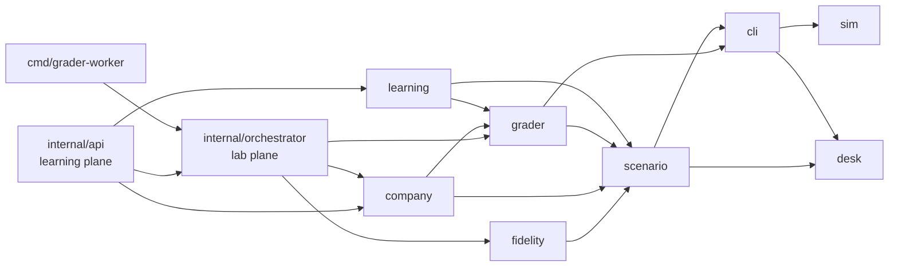

# Phase 0 — Repository audit (Cloud Mastery Blueprint v1, §18–19)

The Cloud Mastery Blueprint asks us to treat the project as **brownfield**:
audit before touching, classify every module as KEEP / EXTEND / REFACTOR /
REPLACE-ONLY-IF-NECESSARY, never delete working features by default, prefer
adapters and feature flags, and record every phase in a changelog.

This document is that audit. It was produced by inspecting the repository tree,
entry points, manifests, routes, persistence and tests. The later phases in
[`01-master-implementation-blueprint.md`](01-master-implementation-blueprint.md)
build on it.

## 1. Stack and entry points

| Item | Finding |
|---|---|
| Language | Go 1.25 (`go.mod` pinned to `go 1.25.0`; x/sync, x/sys pinned for toolchain stability) |
| Binaries | `cmd/gcplab` (API + lab plane, `MODE=all/api/labplane`), `cmd/grader-worker` (isolated grading), `cmd/labctl` (content toolchain) |
| Persistence | `internal/store`: JSON-file store for development, PostgreSQL JSONB documents for production (`DATABASE_URL`) |
| Policy engine | OPA (`open-policy-agent/opa/v1/rego`) over `content/policies/*.rego` |
| IaC parsing | `hashicorp/hcl/v2` (Terraform-lite) |
| LLM | `anthropic-sdk-go` (mentor, optional, never the primary grader) |
| Content | `content/` — YAML labs, skills, tracks, certs, badges, career, failure library, company simulation |
| Frontend | static web app served from `WEB_DIR` (see `web/`) |

## 2. Module inventory and classification

| Module | Responsibility | Classification | Notes |
|---|---|---|---|
| `internal/sim` | Deterministic GCP state engine (F0): hierarchy, IAM with conditions, VPC/firewall/NAT/routes, LB, Cloud Run, GKE, SQL, Pub/Sub, BigQuery, KMS, SCC, cost, logs, metrics, traffic | **KEEP + EXTEND** | Core asset. Extended with folder org policies, PAP in IAM, regional outages, causal-chain recorder, OOM/PVC/RBAC |
| `internal/cli` | Terminal: shell, `gcloud`, `gsutil`, `bq`, `kubectl`, Terraform-lite, net tools | **KEEP + EXTEND** | Extended with desk builtins, `why`/`whatif`, folder/org IAM, Terraform import/state/in-place updates |
| `internal/scenario` | Lab DSL, variants, provisioning, faults | **KEEP + EXTEND** | Extended with ticket/actors, mode, company spec, persistent worlds, failure library and generator |
| `internal/grader` | Rubric validators (state, functional, security/OPA, cost, evidence, quiz) | **KEEP + EXTEND** | Extended with process assessment, desk checks, per-project targeting, k8s RBAC, Terraform state |
| `internal/labtest` | Content-as-code CI | **KEEP + EXTEND** | Also verifies generated incidents and company missions |
| `internal/learning` | XP, mastery formula, badges, leagues, readiness, KPIs, auth | **KEEP + EXTEND** | Extended with skill graph, student model, adaptive engine, career, transcripts. The original mastery formula is unchanged |
| `internal/fidelity` | F0/F1/F2 router, emulator interceptors, project pool, janitor | **KEEP** | Unchanged by the Blueprint work |
| `internal/orchestrator` | Lab plane (sessions, TTL, persistence, remote grading) | **KEEP + EXTEND** | Generated labs, company missions, `Export` |
| `internal/api` | Learning-plane REST API | **KEEP + EXTEND** | New endpoints are additive; no route was removed or changed |
| `internal/mentor` | Socratic hints and optional LLM postmortem review | **KEEP** | Complemented by the deterministic `why`/`whatif` tools |
| `internal/store` | Document store | **KEEP** | New collections: `genlabs`, `companies` |
| New: `internal/desk` | Tickets and simulated actors | **ADD** | |
| New: `internal/company` | Persistent company simulation | **ADD** | |

Nothing was classified REPLACE: no existing file, route or feature was removed.

## 3. Test baseline (before Blueprint work)

| Suite | Result |
|---|---|
| `go test ./internal/cli` (smoke: web VM, Terraform) | pass |
| `go test ./internal/labtest` (ACE 30-day track, 2 variants each) | pass |
| `labctl validate` | pass |

Every phase kept these green and added its own tests (see the changelog).

## 4. Dependency map

The **provider boundary** (Blueprint §17) sits at `internal/sim` + `internal/cli`:
everything above works on labs, checks and learner data and does not encode GCP
concepts. A future AWS/Azure adapter would add a simulator and CLI package pair
and reuse `scenario`, `grader`, `learning`, `desk`, `company` and the API.

## 5. Risks found during the audit

| Risk | Mitigation |
|---|---|
| Lab lookups by map from several goroutines once labs are generated at runtime | `Catalog.Lab()` and `Service.lab()` guard generated labs with locks |
| Grader worker trusting lab definitions sent by the lab plane | Generated incidents and missions are rebuilt by the worker from its own content (spec/mission id only) |
| Learners punished for inherited risks in the company world | Consequences can be `newOnly`; baseline risks are snapshotted at creation |
| Rewrite temptation | This audit and the changelog; every change is additive and covered by tests |
