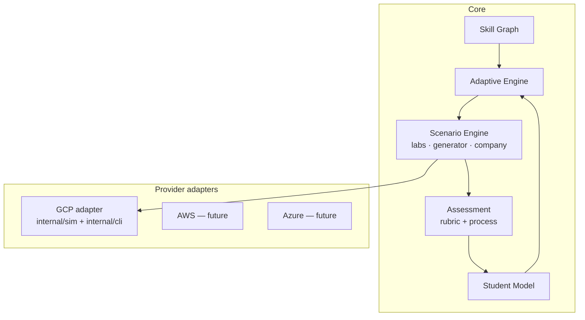

# Master Implementation Blueprint (Cloud Mastery Blueprint v1, §25)

This is the document the Blueprint asks for once the repository is available:
the code inventory ([phase 0 audit](00-repository-audit.md)), the target
architecture, module contracts, data schema, the Lab/Incident DSL, the
implementation phases with their status and tests, and the changelog.

Guiding principle: **learn by working**. The learner creates, breaks,
diagnoses, repairs, explains, documents and demonstrates each competence again
with less and less help — *Learn → Build → Break → Diagnose → Master*.

## 1. Target architecture — the five engines

| Engine (Blueprint §2) | Implementation |
|---|---|
| Knowledge / Skill Graph | `content/skills.yaml` (prerequisite DAG, curriculum blocks), `internal/learning/graph.go` |
| Student Model | `internal/learning/student.go` (9 dimensions, forgetting curve, autonomy ladder, recurring errors) |
| Simulation Engine | `internal/sim` + `internal/cli` (F0), `internal/fidelity` (F1 emulators, F2 real projects) |
| Scenario / Incident Engine | `internal/scenario` (Lab DSL, faults, failure library, generator), `internal/desk` (tickets, actors), `internal/company` (persistent world) |
| Adaptive Learning Engine | `internal/learning/adaptive.go` (spaced repetition, stealth assessment, frontier, remediation) |

## 2. Module contracts

| Contract | Signature (Go) | Guarantees |
|---|---|---|
| Provision a lab | `scenario.Provision(lab, seed, project) (*World, error)` | Deterministic per seed; baseline → setup → faults → traffic; persisted worlds via `Lab.InitialState` |
| Grade | `grader.Grade(lab, state, session, project, sub) *Result` | Grades a clone (never mutates); rubric score **and** `Result.Process` |
| Process assessment | `grader.AssessProcess(lab, session, result, sub, hints)` | Factors: resolution, diagnosis, security, cost, efficiency, risk, communication, documentation, autonomy |
| Generate an incident | `(*scenario.Library).Generate(GenSpec) (*Lab, error)` | Pure function of the spec: the grader worker regenerates the same lab |
| Student model | `(*learning.Engine).Student(attempts, skills) StudentModel` | Derived from attempts only (no migrations needed) |
| Adaptive plan | `(*learning.Engine).Adaptive(attempts, skills, sm) []Recommendation` | May return generated incidents (`Recommendation.Gen`) |
| Company | `company.New`, `(*Company).Start`, `(*Company).Complete` | The world persists between missions; consequences are deterministic |
| Lab plane | `orchestrator.LabPlane` | Start/Info/Exec/View/PutFile/Grade/Stop/Hint/Export over in-process or HTTP |

## 3. Data schema (document store collections)

| Collection | Document | Written by |
|---|---|---|
| `users` | `learning.User` | API (register, OIDC) |
| `attempts` | `learning.Attempt` (includes `grader.Result` with the process report) | API |
| `labsessions` | orchestrator snapshot (state, session, info) | lab plane |
| `classes` | `api.Class` | instructors |
| `genlabs` | `scenario.GenSpec` for generated incidents | API |
| `companies` | `company.Company` (world state, day, pending consequences, metrics, journal) | API |

## 4. Lab / Incident DSL

A scenario is **declarative and composable** (Blueprint §7):

> service + configuration + fault + business context + difficulty + noise + constraints + available evidence + validators + scoring

| DSL field | Blueprint concept |
|---|---|
| `baseline`, `setup` | service + configuration |
| `faults` (≈45 declarative fault types, incl. `region_outage`) | fault |
| `ticket` (INC/REQ/CHG/PRB/SEC/COST/MIG, priority, SLA, impact, comments, attachments) | business context, imperfect initial information |
| `actors` (developer, security, finance, manager, customer, SRE…) with `facts` | people to question for evidence |
| `mode` (`learn`, `lab`, `production`, `architecture`, `career`, `unknown`) | practice modes (§1, §12) |
| `difficulty`, `hints` | difficulty and assistance |
| `faults: log_noise`, decoy resources | noise |
| `constraints` (`no-downtime`, `no-public`, `no-basic-roles`, `no-delete`, `protect:NAME`) | restrictions (checked by the process assessment) |
| `timeline`, logs, metrics, SCC, `why` | available evidence |
| `rubric` validators | validators and scoring (100 points) |
| `company` block | mission in the persistent company |

The **failure library** (`content/failures`) holds systems (healthy
architectures), failure modes (symptom, layer, faults, facts, evidence,
dangerous actions, valid fixes, solution, checks, variants), symptoms (causal
layers, vague and misleading summaries) and business contexts. The
**generator** composes them into ordinary labs, so generated incidents share
provisioning, grading and CI with hand-written labs.

## 5. Phases and status

| Phase (Blueprint §20) | Executable result | Status | Evidence |
|---|---|---|---|
| 0 — Audit | Inventory, test baseline, dependency map | ✅ | [00-repository-audit.md](00-repository-audit.md) |
| 1 — Core model | Skill graph with prerequisites, foundational blocks | ✅ | `content/skills.yaml`, `TestCatalogValid` |
| 2 — Assessment | 9-dimension student model, process scoring, autonomy ladder | ✅ | `TestMasteryFormulaAndStudentModel`, `TestAutonomyLadder`, `TestBlindRestartPenalised` |
| 3 — Lab DSL | Tickets, actors, modes, constraints, company block | ✅ | `internal/scenario/lab.go`, `labctl validate` |
| 4 — GCP state | Resource model and simulated operations | ✅ (pre-existing, extended) | `internal/sim` |
| 5 — Unified UI/CLI | Console views and terminal on the same state | ✅ | `/api/sessions/{id}/views/*`, `web/` |
| 6 — Incidents | Failure library, symptom graph, tickets, generator, P1 mode | ✅ | `TestGeneratedIncidents` (29 cases) |
| 7 — Adaptive | Forgetting curve, spaced repetition, stealth assessment | ✅ | `TestAdaptiveStealthRetention` |
| 8 — Company Sim | Nebula Corporation, missions, consequences | ✅ | `TestMissionsSolvable`, `TestConsequences`, `TestMitigationCancelsConsequence` |
| 9 — Advanced | Architecture, FinOps, Security, DR, Terraform, Kubernetes, Chaos, Interview, Unknown problem, Teach-me-why, What-if | ✅ | labs under `content/labs/{architecture,devops,gke,finops,...}` |
| 10 — Career | Stages, specialisations, capstones, verifiable profile | ✅ | `content/career.yaml`, `TestCareerAndTranscript` |

## 6. Decisions kept open (Blueprint §23) and how they were resolved

| Question | Decision |
|---|---|
| Frontend/backend framework | Go backend kept; web UI is a static app served by the Go binary (no Node runtime required in production) |
| Database and state strategy | Document store (JSON file / PostgreSQL JSONB); state derived from attempts, no destructive migrations |
| Pure logic vs containers/emulators | F0 logic by default; F1 emulators and F2 real projects through the fidelity router, per lab |
| What the terminal interprets | Everything in F0; F1/F2 interceptors take over supported commands |
| Scenario versioning | `version` field on labs; generated labs are pure functions of `GenSpec` |
| AI/model for mentor | Anthropic Claude via the official SDK, opt-in (`MENTOR_LLM=on`), never the primary grader; deterministic `why`/`whatif` first |
| Visual fidelity to the Cloud Console | Own UI with familiar concepts; no pixel copy |

## 7. Changelog

| Phase | Kept | Changed | Added | Validated by |
|---|---|---|---|---|
| 0 | all modules | — | audit docs | baseline tests |
| 1 | skill ids, branches | `Skill` gained `requires`, `Branch` gained `block` | 7 foundational branches, `graph.go` | `TestCatalogValid` |
| 2 | mastery formula, XP, badges | `Result` gained `Process`; `Profile` gained `Student`, `Career`, `Adaptive` | `process.go`, `student.go` | grader + learning tests |
| 3/6 | Lab schema | `Lab` gained `ticket`, `actors`, `mode`, `generated` | `internal/desk`, library, generator, API endpoints | `TestGeneratedIncidents`, `TestGeneratedIncidentFlow` |
| 7 | recommendations | `Recommendation` gained `Gen`, `Skill` | `adaptive.go` | `TestAdaptiveStealthRetention` |
| 8 | orchestrator API | `StartRequest.Mission`, `LabPlane.Export` | `internal/company`, folder org policies, folder/org IAM | company tests, `TestCompanyFlow` |
| 9 | simulator behaviour | request path records a causal chain (opt-in) | `why`, `whatif`, OOM/PVC/RBAC, regional outages, Terraform import/state/in-place, new labs | lab CI |
| 10 | levels/leagues (gamification) | — | career stages, specialisations, signed transcripts | `TestCareerAndTranscript` |

Rollback: every phase is a separate commit on the development branch; features
are additive and the new endpoints/fields are optional, so older clients keep
working.
