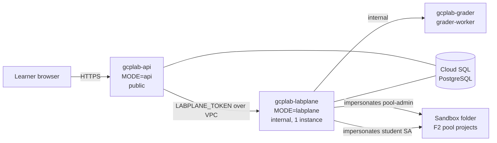

# Operations

## Topology

- **API (learning plane)**: users, attempts, profiles, company worlds. Holds
  no lab state and never executes learner commands.
- **Lab plane**: live sessions (simulator worlds are in memory and snapshotted
  to the store every few commands). It must run as a single instance; restarts
  are safe because sessions are restored from the store.
- **Grader worker**: rebuilds the lab from its own content (never trusts a lab
  definition sent by the lab plane) and grades a copy of the state.

## Deploy

1. Create a platform project inside the organisation and enable billing.
2. `cd deploy/terraform && cp terraform.tfvars.example terraform.tfvars`, fill
   in `org_id`, `billing_account`, `platform_project_id`, `image`.
3. Build and push the image once (the Cloud Run services need it):
   `gcloud builds submit --config deploy/cloudbuild.yaml .` (the deploy step
   fails harmlessly the first time), then `terraform apply`.
4. Optional: add a version to the `gcplab-anthropic-api-key` secret and set
   `mentor_llm = true` for the post-mortem reviewer.
5. Point a domain at the API service (Cloud Run domain mapping or a load
   balancer) and configure OIDC if you use Google Workspace sign-in.

Subsequent releases: `gcloud builds submit --config deploy/cloudbuild.yaml .`
runs tests, builds `runtime-gcloud`, pushes, and rolls grader → lab plane → API.

## Runbooks

| Situation | Action |
|---|---|
| Pool exhausted (learners fall back to F0) | Lab-plane logs (`pool janitor`) or the admin console in single-process mode; raise `sandbox_count` or lower `F2_MONTHLY` |
| Project in QUARANTINE | The pool janitor retries every minute; inspect `orphans` in the admin console, delete leftovers manually, then *Run janitor now* |
| Budget alert on a sandbox | Leases have a TTL and the janitor destroys resources; check the pool event trail for the lease and learner |
| Lab plane restarted | Nothing to do: sessions are restored from `labsessions` on first access |
| Content broken in production | Images are built with `labctl validate`; roll back the Cloud Run revision |
| Rotate secrets | Add a new version of `gcplab-jwt-secret` / `gcplab-labplane-token` and redeploy; JWT rotation signs everyone out and invalidates previously issued transcripts |

Note: in split mode the F2 pool lives in the lab plane, so the admin
console's pool panel (served by the API) shows "not configured"; use the lab
plane logs and the pool event trail there. The single-process mode
(`MODE=all`) shows the pool in the console.

## Backups and data

Cloud SQL has automated backups with point-in-time recovery. Learner data is
limited to account, attempts (scores, command counts, grader results),
company worlds and lab session snapshots. Commands learners type are stored
with sessions for grading and review; tell learners not to paste real secrets.
